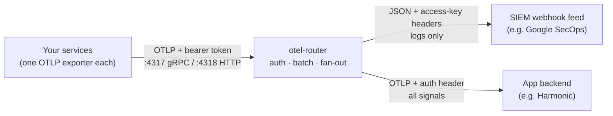

<div align="center">

<picture>
  <source media="(prefers-color-scheme: dark)" srcset="assets/banner-dark.svg">
  
</picture>

**One authenticated OTLP endpoint in. Every destination out.**

[](LICENSE)
[](https://opentelemetry.io/docs/collector/)
[](#-how-it-works)

[Quick start](#-quick-start) ·
[How it works](#-how-it-works) ·
[Configuration](#-configuration) ·
[Security](#-security) ·
[Docs](#-documentation)

</div>

---

## What is otel-router?

Most services can export OpenTelemetry data to exactly one place. When both your
SIEM and your observability platform want that stream, you are stuck.

**otel-router** solves this with a single small container: point every sender at
one authenticated endpoint, and it duplicates the stream to two differently
shaped destinations. It is a pinned build of the official
[OpenTelemetry Collector](https://opentelemetry.io/docs/collector/) (contrib
distribution) driven by one config file. There is no custom code to maintain,
and you get production-grade batching, retries and queueing for free.

Use it when:

- 🛰️ Your **Claude Code / Claude Cowork** telemetry should land in **Google
  SecOps** (or another SIEM) *and* an observability backend such as Harmonic
  at the same time.
- Senders support only one `OTEL_EXPORTER_OTLP_ENDPOINT` but you have two
  or more consumers.
- One destination wants webhook-style JSON with access-key headers, the other
  wants native OTLP.
- You want inbound telemetry gated by a bearer token, with fail-closed startup
  when secrets are missing.

## ⚡ Quick start

**1. Watch it work (needs Docker only).** This runs the router plus stand-ins
for both destinations and fires traces, metrics and logs at it:

```bash
docker compose up
```

In the output, `sink-app` receives all three signals, `webhook-siem` receives
JSON log POSTs carrying the access-key headers, and `gen-noauth` (a sender
without a token) is rejected with `Unauthenticated`.

**2. Assert it works.** Same stack, self-checking, exits 0 or 1:

```bash
./demo/test.sh
```

**3. Run it for real.** Copy the env template, fill in your endpoints and
secrets, build and run:

```bash
cp .env.example .env    # edit with your real values
docker build -t otel-router .
docker run -p 4317:4317 -p 4318:4318 --env-file .env otel-router
```

Then point your senders at it with `Authorization: Bearer <INBOUND_TOKEN>`:

| Protocol  | Endpoint               |
|-----------|------------------------|
| OTLP/gRPC | `http://<router>:4317` |
| OTLP/HTTP | `http://<router>:4318` |

New to OpenTelemetry? [docs/USER_GUIDE.md](docs/USER_GUIDE.md) walks from zero
to production. For vendor-specific steps (Claude Teams managed settings,
Harmonic Security, Google SecOps) see [docs/SETUP.md](docs/SETUP.md).

## 🧭 How it works



Every request must present the inbound bearer token; the Collector's
`bearertokenauth` extension rejects everything else. Valid telemetry is
batched, then fanned out per signal:

| Signal  | SIEM webhook feed | App backend |
|---------|:-----------------:|:-----------:|
| Traces  |                   | ✅          |
| Metrics |                   | ✅          |
| Logs    | ✅                | ✅          |

The two destination shapes cover most real backends:

- **Webhook-style** (`otlphttp/siem`): logs posted as plain JSON to one fixed
  URL with access-key headers. This is the shape of Google SecOps webhook
  feeds and similar HTTPS ingestion endpoints.
- **Native OTLP** (`otlphttp/app`): all three signals to a standard OTLP/HTTP
  base URL with an `Authorization` header.

Delivery behaviour: destinations are independent, so if one is down the other
keeps receiving. Each exporter has an in-memory sending queue with retry and
backoff; brief outages are absorbed, but data is not persisted across a router
restart (add a `file_storage` extension to the sending queues if you need
durability).

## 🔧 Configuration

Everything lives in [`config/otel-router.yaml`](config/otel-router.yaml).
Secrets and endpoints arrive as environment variables at runtime; nothing
sensitive is baked into the image, and startup fails closed if a required
variable is missing.

| Variable        | Required | Purpose                                              |
|-----------------|----------|------------------------------------------------------|
| `INBOUND_TOKEN` | yes      | Bearer token senders must present to this router     |
| `SIEM_ENDPOINT` | yes      | Full webhook feed URL logs are posted to             |
| `SIEM_API_KEY`  | yes      | Value of the `X-goog-api-key` header                 |
| `SIEM_SECRET`   | yes      | Value of the `X-Webhook-Access-Key` header           |
| `APP_ENDPOINT`  | yes      | OTLP/HTTP base URL of the app backend                |
| `APP_AUTH`      | yes      | `Authorization` header value sent to the app backend |
| `TLS_ENABLED`   | no       | `true` to serve TLS on both OTLP ports               |
| `TLS_CERT_FILE` | no       | Container path to a PEM certificate (mounted)        |
| `TLS_KEY_FILE`  | no       | Container path to the PEM private key (mounted)      |

**Choosing which signals go where.** Each signal has its own pipeline; a
destination receives a signal only if its exporter is listed there:

```yaml
pipelines:
  traces:
    exporters: [otlphttp/app]
  metrics:
    exporters: [otlphttp/app]
  logs:
    exporters: [otlphttp/siem, otlphttp/app]
```

**Swapping destination shapes.** Both exporters are `otlphttp`; the difference
is configuration. If your SIEM gains a native OTLP endpoint, replace its
`logs_endpoint`/`encoding`/`compression` lines with a plain `endpoint`. For
vendor formats (Splunk HEC, Elastic, ...) the contrib image already ships the
exporters, so swap the block wholesale.

**Adding a third destination.** Copy one of the `otlphttp/*` exporter blocks
under a new name, add its env vars, list it in the pipelines it should
receive, rebuild.

## 🔒 Security

- **Inbound auth**: one shared bearer token, enforced on both ports by the
  Collector itself. Senders without it get `Unauthenticated`. Rotate it like
  any credential; changing it is a container restart.
- **Transport**: plaintext by default, so terminate TLS in front (reverse
  proxy, cloud load balancer, or a platform with built-in HTTPS) whenever the
  endpoint leaves a private network. Expose only 4318 (OTLP/HTTP) unless a
  sender needs gRPC.
- **Native TLS (optional)**: the router can terminate TLS itself. Mount a PEM
  cert and key, then set `TLS_ENABLED=true`, `TLS_CERT_FILE` and
  `TLS_KEY_FILE`. This is useful for direct exposure or ALB HTTPS target
  groups (a self-signed cert suffices there). Startup fails closed if the
  files are missing or unreadable, and the health endpoint (`:13133`) stays
  plain HTTP for orchestrator probes.
- **Fail-closed startup**: the entrypoint refuses to boot with any required
  secret unset, so the router can never silently forward unauthenticated.

Full threat model and hardening notes: [docs/SECURITY.md](docs/SECURITY.md).

## 🧪 Demos and tests

| Script                      | What it proves                                                        |
|-----------------------------|-----------------------------------------------------------------------|
| `demo/test.sh`              | End-to-end: all signals delivered, headers correct, no-auth rejected  |
| `demo/tls-test.sh`          | The TLS mode: certs served, plaintext refused, fail-closed startup    |
| `demo/send-sample.sh`       | Sends one trace/metric/log by hand (also smoke-tests a deployed router) |
| `demo/cowork-live-test.sh`  | Live run with real Claude Cowork telemetry through a public URL       |

The flagship source, Claude Code telemetry, is enabled with:

```json
{
  "env": {
    "CLAUDE_CODE_ENABLE_TELEMETRY": "1",
    "OTEL_METRICS_EXPORTER": "otlp",
    "OTEL_LOGS_EXPORTER": "otlp",
    "OTEL_EXPORTER_OTLP_PROTOCOL": "http/protobuf",
    "OTEL_EXPORTER_OTLP_ENDPOINT": "https://otel.example.com",
    "OTEL_EXPORTER_OTLP_HEADERS": "Authorization=Bearer <INBOUND_TOKEN>"
  }
}
```

Set these in Claude Code settings, or org-wide via managed settings for
Teams/Enterprise. See
[monitoring usage](https://code.claude.com/docs/en/monitoring-usage).

## 📚 Documentation

| Document                               | Read it when                                                     |
|----------------------------------------|------------------------------------------------------------------|
| [docs/USER_GUIDE.md](docs/USER_GUIDE.md) | You are new to OpenTelemetry: concepts to production, start to finish |
| [docs/SETUP.md](docs/SETUP.md)         | You are wiring up Claude Teams, Harmonic Security or Google SecOps |
| [docs/SECURITY.md](docs/SECURITY.md)   | You want the threat model, secret handling and hardening guidance |

## Project layout

```
Dockerfile                pinned Collector (contrib) image + busybox entrypoint layer
entrypoint.sh             fail-closed startup checks, optional TLS wiring
config/otel-router.yaml   the router: one source, auth, two destinations
config/tls.yaml           TLS overlay merged in when TLS_ENABLED=true
docker-compose.yml        demo harness (router + both sinks + traffic generators)
demo/                     end-to-end tests, sample sender, live Cowork test
docs/                     user guide, vendor setup, security notes
```

## License

[MIT](LICENSE)
