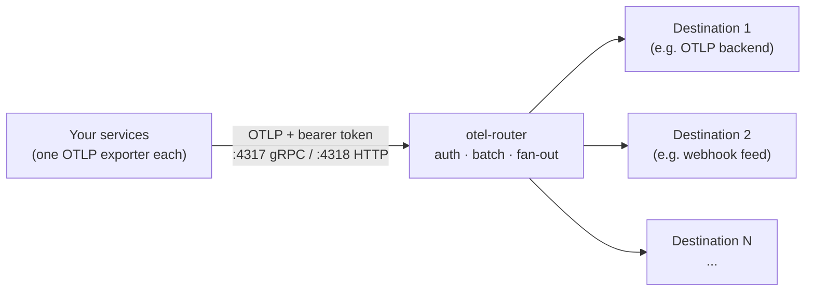

<div align="center">

<picture>
  <source media="(prefers-color-scheme: dark)" srcset="assets/banner-dark.svg">
  
</picture>

**One authenticated OTLP endpoint in. Any number of destinations out.**

[](LICENSE)
[](https://opentelemetry.io/docs/collector/)
[](#-how-it-works)

[Quick start](#-quick-start) ·
[How it works](#-how-it-works) ·
[Configuration](#-configuration) ·
[Security](#-security) ·
[Docs](#-documentation)

</div>

---

## What is otel-router?

Most services can export OpenTelemetry data to exactly one place. When several
systems want that same stream, you are stuck.

**otel-router** solves this with a single small container: point every sender at
one authenticated endpoint, and it duplicates the stream to as many destinations
as you define. It is a pinned build of the official
[OpenTelemetry Collector](https://opentelemetry.io/docs/collector/) (contrib
distribution). You describe your destinations in one small YAML file, so there
is no custom code to maintain, and you get production-grade batching, retries
and queueing for free.

Destinations are entirely yours to define. A destination can be any HTTP or OTLP
service: an observability backend, a SIEM feed, a data lake, a second collector,
a webhook. Each one chooses which signals it receives (traces, metrics, logs)
and carries whatever auth headers it needs.

Use it when:

- 🛰️ Your **Claude Code / Claude Cowork** telemetry needs to reach more than one
  system at once (the shipped example fans out to an OTLP backend such as
  Harmonic and a webhook feed such as Google SecOps).
- Senders support only one `OTEL_EXPORTER_OTLP_ENDPOINT` but you have several
  consumers.
- Different destinations want different shapes: native OTLP for one, webhook
  JSON with custom headers for another.
- You want inbound telemetry gated by a bearer token, with fail-closed startup.

## ⚡ Quick start

**1. Watch it work (needs Docker only).** This runs the router plus stand-ins
for two example destinations and fires traces, metrics and logs at it:

```bash
docker compose up
```

In the output, `sink-backend` receives all three signals, `sink-webhook`
receives JSON log POSTs carrying the access-key headers, and `gen-noauth` (a
sender without a token) is rejected with `Unauthenticated`.

**2. Assert it works.** Same stack, self-checking, exits 0 or 1:

```bash
./test/test.sh
```

**3. Run it for real.** Copy the env template, fill in your endpoints and
secrets, then edit `config/destinations.yaml` to match the destinations you
want. Build and run:

```bash
cp .env.example .env    # edit with your real values
docker build -t otel-router .
docker run -p 4317:4317 -p 4318:4318 --env-file .env otel-router
```

Then point your senders at it with `Authorization: Bearer <INBOUND_TOKEN>`:

| Protocol  | Endpoint               |
|-----------|------------------------|
| OTLP/gRPC | `http://<router>:4317` |
| OTLP/HTTP | `http://<router>:4318` |

New to OpenTelemetry? [docs/USER_GUIDE.md](docs/USER_GUIDE.md) walks from zero
to production. For a worked vendor example (Claude Teams managed settings,
Harmonic Security, Google SecOps) see [docs/SETUP.md](docs/SETUP.md).

## 🧭 How it works



Every request must present the inbound bearer token; the Collector's
`bearertokenauth` extension rejects everything else. Valid telemetry is
batched, then fanned out to each destination according to your pipelines. You
decide, per destination, which signals it receives. The shipped example wires
two destinations like this:

| Signal  | Example: OTLP backend | Example: webhook feed |
|---------|:---------------------:|:---------------------:|
| Traces  | ✅                    |                       |
| Metrics | ✅                    |                       |
| Logs    | ✅                    | ✅                    |

A destination is just an exporter plus a line in each pipeline it should feed.
Two common shapes cover most backends, and both ship as examples you can copy:

- **Native OTLP**: standard `/v1/{traces,metrics,logs}` paths under one base URL
  with an `Authorization` header. Suits most observability backends.
- **Webhook-style**: logs posted as plain JSON to one fixed URL with custom
  access-key headers. Suits SIEM feeds and similar HTTPS ingestion endpoints.

Delivery behaviour: destinations are independent, so if one is down the others
keep receiving. Each exporter has an in-memory sending queue with retry and
backoff; brief outages are absorbed, but data is not persisted across a router
restart (add a `file_storage` extension to the sending queues if you need
durability).

## 🔧 Configuration

The config is split into two files that the Collector merges at startup:

- [`config/base.yaml`](config/base.yaml): the fixed core (receivers, inbound
  auth, batching). You rarely touch this.
- [`config/destinations.yaml`](config/destinations.yaml): your destinations
  (exporters plus the per-signal pipelines). **This is the file you edit.**

Endpoints and secrets arrive as environment variables at runtime via
`${env:...}`; nothing sensitive is baked into the image. Only `INBOUND_TOKEN` is
required by the router. Every other variable exists only because a destination
in `destinations.yaml` references it, so the set is yours to define.

| Variable        | Required | Purpose                                                       |
|-----------------|----------|---------------------------------------------------------------|
| `INBOUND_TOKEN` | yes      | Bearer token senders must present to this router              |
| `REQUIRE_ENV`   | no       | Space-separated vars to also fail closed on if unset          |
| `TLS_ENABLED`   | no       | `true` to serve TLS on both OTLP ports                        |
| `TLS_CERT_FILE` | no       | Container path to a PEM certificate (mounted)                 |
| `TLS_KEY_FILE`  | no       | Container path to the PEM private key (mounted)               |

The shipped example `destinations.yaml` additionally references `BACKEND_ENDPOINT`
and `BACKEND_AUTH` (its OTLP destination) and `WEBHOOK_ENDPOINT`,
`WEBHOOK_API_KEY` and `WEBHOOK_SECRET` (its webhook destination). Rename these to
whatever suits your destinations.

**Adding, removing or changing a destination.** Edit `destinations.yaml`: add an
exporter block, then list it in each pipeline that should feed it. To change
where an existing destination sends, edit its `endpoint` and `headers`. Header
names are whatever the destination expects; they are not fixed by the router.

```yaml
# in config/destinations.yaml
exporters:
  otlphttp/backend:      # native OTLP: all signals
    endpoint: ${env:BACKEND_ENDPOINT}
    headers: { Authorization: "${env:BACKEND_AUTH}" }
  otlphttp/webhook:      # webhook JSON: logs only
    logs_endpoint: ${env:WEBHOOK_ENDPOINT}
    encoding: json
    headers: { X-Api-Key: "${env:WEBHOOK_API_KEY}" }

service:
  pipelines:
    traces:  { receivers: [otlp], processors: [batch], exporters: [otlphttp/backend] }
    metrics: { receivers: [otlp], processors: [batch], exporters: [otlphttp/backend] }
    logs:    { receivers: [otlp], processors: [batch], exporters: [otlphttp/backend, otlphttp/webhook] }
```

**Change destinations without rebuilding.** Mount your own file over the baked
one:

```bash
docker run ... -v $(pwd)/my-destinations.yaml:/etc/otelcol-contrib/destinations.yaml:ro otel-router
```

## 🔒 Security

- **Inbound auth**: a bearer token, enforced on both ports by the Collector
  itself. Senders without it get `Unauthenticated`. Rotate it like any
  credential; changing it is a container restart.
- **Fail-closed startup**: the entrypoint refuses to boot if `INBOUND_TOKEN` is
  unset. Because destinations are yours to define, outbound secrets are not
  enforced by default; list the ones you cannot run without in `REQUIRE_ENV`
  (space-separated) to extend the same guarantee to them.
- **Transport**: plaintext by default, so terminate TLS in front (reverse
  proxy, cloud load balancer, or a platform with built-in HTTPS) whenever the
  endpoint leaves a private network. Expose only 4318 (OTLP/HTTP) unless a
  sender needs gRPC.
- **Native TLS (optional)**: the router can terminate TLS itself. Mount a PEM
  cert and key, then set `TLS_ENABLED=true`, `TLS_CERT_FILE` and
  `TLS_KEY_FILE`. Useful for direct exposure or ALB HTTPS target groups (a
  self-signed cert suffices there). Startup fails closed if the files are
  missing or unreadable, and the health endpoint (`:13133`) stays plain HTTP
  for orchestrator probes.

Full threat model and hardening notes: [docs/SECURITY.md](docs/SECURITY.md).

## 🧪 Demos and tests

| Script                      | What it proves                                                        |
|-----------------------------|-----------------------------------------------------------------------|
| `test/test.sh`              | Narrated end-to-end test (also runs in CI): all signals delivered, headers correct, logs-only filtered, no-auth rejected |
| `test/send-sample.sh`       | Sends one trace/metric/log by hand (also smoke-tests a deployed router) |
| `test/cowork-live-test.sh`  | Live run with real Claude Cowork telemetry through a public URL       |

The flagship source, Claude Code telemetry, is enabled with:

```json
{
  "env": {
    "CLAUDE_CODE_ENABLE_TELEMETRY": "1",
    "OTEL_METRICS_EXPORTER": "otlp",
    "OTEL_LOGS_EXPORTER": "otlp",
    "OTEL_EXPORTER_OTLP_PROTOCOL": "http/protobuf",
    "OTEL_EXPORTER_OTLP_ENDPOINT": "https://otel.example.com",
    "OTEL_EXPORTER_OTLP_HEADERS": "Authorization=Bearer <INBOUND_TOKEN>"
  }
}
```

Set these in Claude Code settings, or org-wide via managed settings for
Teams/Enterprise. See
[monitoring usage](https://code.claude.com/docs/en/monitoring-usage).

## 📚 Documentation

| Document                               | Read it when                                                     |
|----------------------------------------|------------------------------------------------------------------|
| [docs/USER_GUIDE.md](docs/USER_GUIDE.md) | You are new to OpenTelemetry: concepts to production, start to finish |
| [docs/SETUP.md](docs/SETUP.md)         | You want a worked example: Claude Teams, Harmonic Security, Google SecOps |
| [docs/SECURITY.md](docs/SECURITY.md)   | You want the threat model, secret handling and hardening guidance |

## Project layout

```
Dockerfile                 pinned Collector (contrib) image + busybox entrypoint layer
entrypoint.sh              fail-closed startup checks, optional TLS wiring
config/base.yaml           fixed core: receivers, inbound auth, batching
config/destinations.yaml   your destinations: exporters + per-signal pipelines
config/tls.yaml            TLS overlay merged in when TLS_ENABLED=true
docker-compose.yml         demo harness (router + two example sinks + generators)
test/                      end-to-end tests, sample sender, live Cowork test
terraform/                 AWS deployment modules (ECS Fargate): private ALB + public NLB
docs/                      user guide, vendor setup, security notes
```

## License

[MIT](LICENSE)
