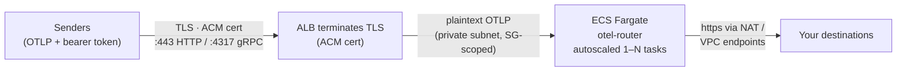
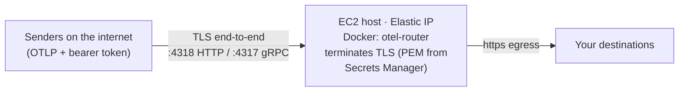

# Deploying otel-router on AWS

Terraform modules that run otel-router on AWS, with the inbound token (and any
destination credentials) injected from AWS Secrets Manager. Two deployment
models ship as separate modules; they differ in the infrastructure they run on,
not in who may reach the endpoint. Both terminate the sender's TLS and enforce
the inbound bearer token.

There is no published container image: you build from the repo
[Dockerfile](../Dockerfile), push to your own registry (ECR), and hand the
modules the image URI.

## Choosing a deployment model

The real axis is **the infrastructure you already run**, not the load balancer
or who is allowed to connect. Pick by whether you run ECS:

- [`modules/ecs-fargate`](modules/ecs-fargate/) runs the router as a **managed
  ECS Fargate service** behind an Application Load Balancer that terminates TLS
  with an ACM certificate. The container is always private; only the ALB is
  exposed. You get autoscaling, rolling deploys with a circuit breaker, and
  AWS-managed certificates. **For teams already on ECS.**
- [`modules/ec2-docker`](modules/ec2-docker/) runs the container on a **single
  EC2 instance** via Docker, directly internet-facing on an Elastic IP, with
  the **container itself** terminating TLS using a PEM pair you store in
  Secrets Manager. No ECS, no load balancer — one box you run. **For teams not
  using ECS.**

Either way the sender's connection is TLS-terminated (at the ALB for
`ecs-fargate`, in the container for `ec2-docker`) and every request must still
carry the inbound bearer token, which the router itself enforces. A caller that
reaches the endpoint without the token gets `Unauthenticated`. Transport and
auth stay independent layers: terminating TLS never means accepting
unauthenticated telemetry.

| | [`modules/ecs-fargate`](modules/ecs-fargate/) | [`modules/ec2-docker`](modules/ec2-docker/) |
|---|---|---|
| Runs on | ECS Fargate, managed | One EC2 instance you run |
| TLS terminates at | The ALB, with an ACM cert | The container, with your PEM pair |
| Front door | Internet-facing ALB (VPC-only optional via `internal`) | The instance's Elastic IP |
| Scaling | Autoscaling, 1..N tasks | A single instance |
| Certificate | ACM-managed (real CA, auto-renewed) | PEM cert + key in Secrets Manager |
| OTLP/gRPC `:4317` | Yes | Yes (drop with `enable_grpc = false`) |
| OTLP/HTTP `:4318` | Yes (served on `:443` by default) | Yes |
| Best for | Teams already on ECS | Teams not using ECS |

**Pick `ecs-fargate`** if you already run ECS — you get managed capacity,
autoscaling and AWS-managed certificates, with the only caveat that the ALB
decrypts and forwards plaintext to the container over a security-group-scoped
hop inside the VPC.

**Pick `ec2-docker`** if you do not run ECS and want the smallest thing that
works: one instance, one Elastic IP, TLS terminated end to end in the container
so nothing between the sender and the collector ever holds the key or sees
plaintext — at the cost of managing the PEM pair yourself and running a single
box (mitigated by auto-recovery; see the operational notes).

## Architecture

**ecs-fargate** — an internet-facing ALB terminates TLS with ACM; the router
runs plaintext in a private subnet behind it:



**ec2-docker** — one EC2 host, reached on its Elastic IP; the container holds
the key and terminates TLS itself:



The `ecs-fargate` tasks sit in private subnets and reach ECR and your
destinations through a NAT gateway or VPC endpoints; the `ec2-docker` instance
sits in a public subnet and reaches them directly over its Elastic IP. The
health port `:13133` stays plain HTTP in every mode by design — on `ecs-fargate`
it is probed only from inside the VPC, and on `ec2-docker` it is never published
off the host at all (the Docker healthcheck probes it locally).

## Prerequisites

**1. Build and push the image (both models).** From the repo root:

```bash
aws ecr create-repository --repository-name otel-router
aws ecr get-login-password | docker login --username AWS --password-stdin \
  <account-id>.dkr.ecr.<region>.amazonaws.com
docker build -t <account-id>.dkr.ecr.<region>.amazonaws.com/otel-router:0.156.0 .
docker push <account-id>.dkr.ecr.<region>.amazonaws.com/otel-router:0.156.0
```

Building on an Apple Silicon or other ARM machine? Add `--platform linux/amd64`
to the build. `ecs-fargate` can instead match the image with
`otel_router_config = { cpu_architecture = "ARM64" }`; the `ec2-docker` module
defaults to an x86_64 instance, so build an amd64 image for it (or set a
Graviton `instance_type` and build arm64).

**2. The inbound token secret (both models).** [example.tf](example.tf) creates
this one itself (as `otel-router/inbound-token`, generated with
`random_password`), so **skip this step if you apply the example as-is** —
creating the same name twice fails. The out-of-band route below keeps the value
out of Terraform state; to use it, delete the `random_password` /
`aws_secretsmanager_secret` resources from your copy and pass this secret's ARN
in like the destination secrets. Same rule as [.env.example](../.env.example):
real randomness, never by hand.

```bash
aws secretsmanager create-secret \
  --name otel-router/inbound-token \
  --secret-string "$(openssl rand -hex 32)"
```

**3. Create your destination credential secrets (both models).** Destinations
are yours to define in [config/destinations.yaml](../config/destinations.yaml),
and every `${env:...}` variable referenced by the file baked into your image
must be provided at deploy time — the collector refuses to start otherwise. The
shipped example config defines two destinations, needing one credential header
value and two webhook keys:

```bash
aws secretsmanager create-secret \
  --name otel-router/backend-auth \
  --secret-string "Bearer <your-backend-token>"
aws secretsmanager create-secret \
  --name otel-router/webhook-api-key \
  --secret-string "<your-webhook-api-key>"
aws secretsmanager create-secret \
  --name otel-router/webhook-secret \
  --secret-string "<your-webhook-feed-secret>"
```

Keeping only one destination? Remove the other from `destinations.yaml`
before building the image, and drop its variables from the module call.

**4a. ecs-fargate: a certificate in ACM** covering the hostname senders dial.
Issue one with DNS validation:

```bash
aws acm request-certificate \
  --domain-name otel.internal.example.com \
  --validation-method DNS
```

**4b. ec2-docker: a PEM cert + key in Secrets Manager.** The container serves
them itself. For testing, the self-signed one-liner from
[.env.example](../.env.example) (set the SAN to the hostname clients dial — for
production use a CA-issued pair instead, since senders must trust the
certificate):

```bash
openssl req -x509 -newkey rsa:2048 -nodes -days 365 \
  -keyout tls.key -out tls.crt \
  -subj "/CN=otel.example.com" -addext "subjectAltName=DNS:otel.example.com"

aws secretsmanager create-secret --name otel-router/tls-cert --secret-string file://tls.crt
aws secretsmanager create-secret --name otel-router/tls-key  --secret-string file://tls.key
```

## Usage

[example.tf](example.tf) is a complete, adaptable root module: provider, VPC,
inbound-token secret and both modules wired end to end. Copy it, delete the
model you are not using, then:

```bash
terraform init
terraform plan
terraform apply
```

The minimal shape of each module call (an existing VPC works fine — pass its
IDs directly). **ecs-fargate:**

```hcl
module "otel_router" {
  # From this checkout:
  source = "./modules/ecs-fargate"
  # Or pinned from git:
  # source = "github.com/edmerrett/otel-router//terraform/modules/ecs-fargate?ref=<tag>"

  vpc_id                   = "vpc-..."
  task_subnet_ids          = ["subnet-private-a", "subnet-private-b"]
  lb_subnet_ids            = ["subnet-public-a", "subnet-public-b"]
  image                    = "<account-id>.dkr.ecr.<region>.amazonaws.com/otel-router:0.156.0"
  inbound_token_secret_arn = "arn:aws:secretsmanager:..."
  certificate_arn          = "arn:aws:acm:..."

  alb_config = {
    allowed_cidrs = ["10.0.0.0/16"]
  }

  otel_router_config = {
    # Cover EVERY variable your baked-in destinations.yaml references — the
    # collector refuses to start on unset ones. This shape assumes an image
    # built with only the backend destination; the shipped two-destination
    # config also needs the WEBHOOK_* variables (see example.tf).
    extra_environment_variables = { BACKEND_ENDPOINT = "https://your-backend.example.com:4318" }
    extra_secrets               = { BACKEND_AUTH = "arn:aws:secretsmanager:..." }
    require_env                 = ["BACKEND_ENDPOINT", "BACKEND_AUTH"]
  }
}
```

**ec2-docker** — a single public subnet, TLS cert/key from Secrets Manager, and
the same fail-closed `allowed_cidrs`:

```hcl
module "otel_router" {
  # From this checkout:
  source = "./modules/ec2-docker"
  # Or pinned from git:
  # source = "github.com/edmerrett/otel-router//terraform/modules/ec2-docker?ref=<tag>"

  vpc_id                   = "vpc-..."
  subnet_id                = "subnet-public-a" # one public subnet
  image                    = "<account-id>.dkr.ecr.<region>.amazonaws.com/otel-router:0.156.0"
  inbound_token_secret_arn = "arn:aws:secretsmanager:..."
  tls_cert_secret_arn      = "arn:aws:secretsmanager:..." # PEM cert (full chain)
  tls_key_secret_arn       = "arn:aws:secretsmanager:..." # PEM key

  # Required and fail-closed: name at least one CIDR. The bearer token still
  # gates content; narrow to your senders' egress CIDRs if you know them.
  allowed_cidrs = ["0.0.0.0/0"]

  router_config = {
    extra_environment_variables = { BACKEND_ENDPOINT = "https://your-backend.example.com:4318" }
    extra_secrets               = { BACKEND_AUTH = "arn:aws:secretsmanager:..." }
    require_env                 = ["BACKEND_ENDPOINT", "BACKEND_AUTH"]
  }
}
```

Both modules refuse to plan without at least one allowed ingress source — an
unreachable router fails loudly, not silently.

## Wiring senders

`ecs-fargate` outputs `otlp_http_endpoint` and `otlp_grpc_endpoint`;
`ec2-docker` outputs the same pair plus `public_ip` (the Elastic IP). In
production, point a DNS name matching the certificate SAN at the ALB (a Route 53
alias/CNAME) or at the Elastic IP (an A record), and hand senders that
hostname — not the raw AWS DNS name or IP — so the certificate validates.

For Claude Code telemetry (the flagship source; see the
[root README](../README.md)), point the settings at your endpoint:

```json
{
  "env": {
    "CLAUDE_CODE_ENABLE_TELEMETRY": "1",
    "OTEL_METRICS_EXPORTER": "otlp",
    "OTEL_LOGS_EXPORTER": "otlp",
    "OTEL_EXPORTER_OTLP_PROTOCOL": "http/protobuf",
    "OTEL_EXPORTER_OTLP_ENDPOINT": "https://otel.example.com:4318",
    "OTEL_EXPORTER_OTLP_HEADERS": "Authorization=Bearer <INBOUND_TOKEN>"
  }
}
```

Set these in Claude Code settings, or org-wide via managed settings for
Teams/Enterprise. Read the token back when distributing it:

```bash
aws secretsmanager get-secret-value \
  --secret-id otel-router/inbound-token --query SecretString --output text
```

Smoke-test a fresh deployment with
[test/send-sample.sh](../test/send-sample.sh) pointed at the HTTP endpoint.

## Operational notes

- **ALB idle timeout vs gRPC (ecs-fargate).** ALBs do not honour HTTP/2 PING
  keepalives; only real data resets the idle timer. The `ecs-fargate` module
  raises the timeout to 300s (`alb_config.idle_timeout`) — make sure senders
  export at least that often or expect long-lived gRPC streams to be reset.
- **gRPC health-check subtlety (ecs-fargate).** A GRPC target group cannot
  probe the plain HTTP health port; its health check speaks gRPC on the traffic
  port and any gRPC status (the unauthenticated probe gets `UNAUTHENTICATED`)
  counts as healthy. Proof of "server up", not "pipelines healthy" — the HTTP
  target group covers the real `:13133` health endpoint.
- **Secret rotation is a restart.** On `ecs-fargate`, ECS injects secrets when a
  task starts, so after updating a secret value run
  `aws ecs update-service --force-new-deployment`. On `ec2-docker`, the systemd
  unit re-fetches every secret and the cert/key from Secrets Manager into tmpfs
  on each (re)start, so rotation is just `systemctl restart otel-router` (or a
  reboot) — nothing secret persists on the EBS volume.
- **Single instance vs autoscaling (ec2-docker).** `ec2-docker` runs one box:
  an underlying-hardware failure means a brief outage. The module's CloudWatch
  auto-recovery alarm recovers the instance on a failed system status check,
  keeping the same instance id and Elastic IP; app crashes are handled by
  `systemd Restart=always` plus Docker's own restart. If you need
  multi-instance redundancy, use `ecs-fargate` instead.
- **Instance access (ec2-docker).** The instance runs no SSH port by default;
  shell access is via SSM Session Manager (the instance profile carries
  `AmazonSSMManagedInstanceCore`). Pass `key_name` only if you specifically want
  SSH.
- **Certificate must match the dialed hostname (ec2-docker).** Senders validate
  the container's certificate, so its SAN must match the DNS name pointed at the
  Elastic IP (or be an IP SAN for the raw address). This is the PEM pair you
  stored in Secrets Manager, not an ACM certificate.
- **Customer-managed KMS keys (both).** If your secrets are encrypted with a
  CMK, the reading principal also needs `kms:Decrypt` on that key. On
  `ecs-fargate` pass a policy ARN via
  `otel_router_config.extra_execution_iam_policies`; on `ec2-docker` attach the
  grant to the instance role out of band (the module's inline policy covers
  `secretsmanager:GetSecretValue` only).
- **Non-ECR registries (ec2-docker).** The instance authenticates ECR pulls via
  its instance profile. A non-ECR registry needs its own credentials configured
  on the host.

**Cost, roughly.** `ecs-fargate`: one always-on Fargate task (0.25 vCPU / 512
MiB), an ALB, and — if you create one — a NAT gateway; on the order of tens of
dollars a month before traffic, with the NAT gateway often the largest line.
`ec2-docker`: a single instance (a `t3.small` by default) plus its Elastic IP,
no load balancer or NAT — typically the cheaper floor. Data processing scales
with telemetry volume in both. Run `terraform destroy` on experiments.

## Inputs and outputs

The full variable and output reference lives with each module:

- [modules/ecs-fargate/README.md](modules/ecs-fargate/README.md)
- [modules/ec2-docker/README.md](modules/ec2-docker/README.md)

Both share the core inputs where they make sense (`name`, `vpc_id`, `image`,
`inbound_token_secret_arn`, destination env/secrets, `tags`) and diverge on the
rest: `ecs-fargate` takes `task_subnet_ids` / `lb_subnet_ids` /
`certificate_arn` / `alb_config` / `otel_router_config`, while `ec2-docker`
takes a single `subnet_id`, the `tls_cert_secret_arn` / `tls_key_secret_arn`
pair, `allowed_cidrs`, and a slimmer `router_config`.
