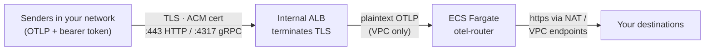
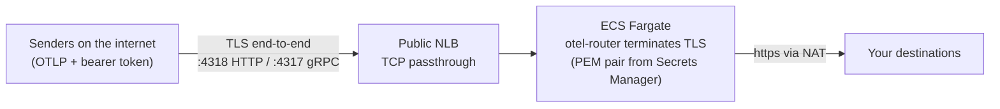

# Deploying otel-router on AWS

Terraform modules that run otel-router on ECS Fargate behind a load balancer,
with the inbound token (and any destination credentials) injected from AWS
Secrets Manager. Two deployment models ship as separate modules; pick the one
that matches where your senders live.

There is no published container image: you build from the repo
[Dockerfile](../Dockerfile), push to your own registry (ECR), and hand the
modules the image URI. Both modules create everything else — load balancer,
target groups, security groups, ECS cluster (optional), task definition,
service, IAM roles, CloudWatch logs and autoscaling.

## Choosing a deployment model

| | [`modules/private-alb`](modules/private-alb/) | [`modules/public-nlb`](modules/public-nlb/) |
|---|---|---|
| Who dials it | Senders inside your network (VPC, VPN, peering) | Senders on the internet (developer laptops, SaaS) |
| Load balancer | Internal Application Load Balancer | Internet-facing Network Load Balancer |
| TLS terminates at | The ALB | The router container itself (TCP passthrough) |
| Certificate source | ACM (issued or imported) | PEM cert + key in Secrets Manager |
| Router sees | Plaintext OTLP inside the VPC | TLS end-to-end, decrypted with its own key |
| OTLP/gRPC `:4317` | Yes (GRPC target group; on by default) | Yes (TCP passthrough; on by default) |
| OTLP/HTTP `:4318` | Yes (served on `:443` by default) | Yes |

Rule of thumb: if every sender can already reach a private IP in your VPC,
use `private-alb` and let ACM handle certificates. If senders arrive over the
internet — the flagship case being Claude Code telemetry from a fleet of
laptops — use `public-nlb` so telemetry stays encrypted all the way into the
container.

## Architecture

**private-alb** — internal ALB terminates TLS; plaintext only inside the VPC:



**public-nlb** — internet-facing NLB passes TCP through; the router holds the key:



In both models the Fargate tasks sit in private subnets and reach ECR and
your destinations through a NAT gateway or VPC endpoints. The health port
`:13133` stays plain HTTP in every mode by design; it is only ever probed
from inside the VPC.

## Prerequisites

**1. Build and push the image.** From the repo root:

```bash
aws ecr create-repository --repository-name otel-router
aws ecr get-login-password | docker login --username AWS --password-stdin \
  <account-id>.dkr.ecr.<region>.amazonaws.com
docker build -t <account-id>.dkr.ecr.<region>.amazonaws.com/otel-router:0.156.0 .
docker push <account-id>.dkr.ecr.<region>.amazonaws.com/otel-router:0.156.0
```

Building on an Apple Silicon or other ARM machine? Either add
`--platform linux/amd64` to the build, or pass
`otel_router_config = { cpu_architecture = "ARM64" }` so Fargate matches your
image.

**2. The inbound token secret.** [example.tf](example.tf) creates this one
itself (as `otel-router/inbound-token`, generated with `random_password`), so
**skip this step if you apply the example as-is** — creating the same name
twice fails. The out-of-band route below keeps the value out of Terraform
state; to use it, delete the `random_password` / `aws_secretsmanager_secret`
resources from your copy and pass this secret's ARN in like the destination
secrets. Same rule as [.env.example](../.env.example): real randomness, never
by hand.

```bash
aws secretsmanager create-secret \
  --name otel-router/inbound-token \
  --secret-string "$(openssl rand -hex 32)"
```

**3. Create your destination credential secrets.** Destinations are yours to
define in [config/destinations.yaml](../config/destinations.yaml), and every
`${env:...}` variable referenced by the file baked into your image must be
provided at deploy time — the collector refuses to start otherwise. The
shipped example config defines two destinations, needing one credential
header value and two webhook keys:

```bash
aws secretsmanager create-secret \
  --name otel-router/backend-auth \
  --secret-string "Bearer <your-backend-token>"
aws secretsmanager create-secret \
  --name otel-router/webhook-api-key \
  --secret-string "<your-webhook-api-key>"
aws secretsmanager create-secret \
  --name otel-router/webhook-secret \
  --secret-string "<your-webhook-feed-secret>"
```

Keeping only one destination? Remove the other from `destinations.yaml`
before building the image, and drop its variables from the module call.

**4a. private-alb: a certificate in ACM** covering the hostname senders dial.
Issue one with DNS validation:

```bash
aws acm request-certificate \
  --domain-name otel.internal.example.com \
  --validation-method DNS
```

**4b. public-nlb: a PEM cert + key in Secrets Manager.** The NLB never touches
them; the router serves them itself. For testing, the self-signed one-liner
from [.env.example](../.env.example) (set the SAN to the hostname clients
dial — for production use a CA-issued pair instead, since senders must trust
the certificate):

```bash
openssl req -x509 -newkey rsa:2048 -nodes -days 365 \
  -keyout tls.key -out tls.crt \
  -subj "/CN=otel.example.com" -addext "subjectAltName=DNS:otel.example.com"

aws secretsmanager create-secret --name otel-router/tls-cert --secret-string file://tls.crt
aws secretsmanager create-secret --name otel-router/tls-key  --secret-string file://tls.key
```

## Usage

[example.tf](example.tf) is a complete, adaptable root module: provider, VPC,
inbound-token secret and both modules wired end to end. Copy it, delete the
model you are not using, then:

```bash
terraform init
terraform plan
terraform apply
```

The minimal shape of a module call (an existing VPC works fine — pass its
IDs directly):

```hcl
module "otel_router" {
  # From this checkout:
  source = "./modules/private-alb"
  # Or pinned from git:
  # source = "github.com/edmerrett/otel-router//terraform/modules/private-alb?ref=<tag>"

  vpc_id                   = "vpc-..."
  task_subnet_ids          = ["subnet-private-a", "subnet-private-b"]
  lb_subnet_ids            = ["subnet-private-a", "subnet-private-b"]
  image                    = "<account-id>.dkr.ecr.<region>.amazonaws.com/otel-router:0.156.0"
  inbound_token_secret_arn = "arn:aws:secretsmanager:..."
  certificate_arn          = "arn:aws:acm:..."

  alb_config = {
    allowed_cidrs = ["10.0.0.0/16"]
  }

  otel_router_config = {
    # Cover EVERY variable your baked-in destinations.yaml references — the
    # collector refuses to start on unset ones. This shape assumes an image
    # built with only the backend destination; the shipped two-destination
    # config also needs the WEBHOOK_* variables (see example.tf).
    extra_environment_variables = { BACKEND_ENDPOINT = "https://your-backend.example.com:4318" }
    extra_secrets               = { BACKEND_AUTH = "arn:aws:secretsmanager:..." }
    require_env                 = ["BACKEND_ENDPOINT", "BACKEND_AUTH"]
  }
}
```

`public-nlb` swaps `certificate_arn`/`alb_config` for
`tls_cert_secret_arn`/`tls_key_secret_arn`/`nlb_config` and requires
`lb_subnet_ids` to be public subnets. Both modules refuse to plan without at
least one allowed ingress source — an unreachable router fails loudly, not
silently.

## Wiring senders

Each module outputs `otlp_http_endpoint` and `otlp_grpc_endpoint`. For the
public NLB, CNAME a real hostname matching the certificate SAN to
`lb_dns_name` and hand senders that hostname, not the raw AWS DNS name.

For Claude Code telemetry (the flagship source; see the
[root README](../README.md)), point the settings at your endpoint:

```json
{
  "env": {
    "CLAUDE_CODE_ENABLE_TELEMETRY": "1",
    "OTEL_METRICS_EXPORTER": "otlp",
    "OTEL_LOGS_EXPORTER": "otlp",
    "OTEL_EXPORTER_OTLP_PROTOCOL": "http/protobuf",
    "OTEL_EXPORTER_OTLP_ENDPOINT": "https://otel.example.com:4318",
    "OTEL_EXPORTER_OTLP_HEADERS": "Authorization=Bearer <INBOUND_TOKEN>"
  }
}
```

Set these in Claude Code settings, or org-wide via managed settings for
Teams/Enterprise. Read the token back when distributing it:

```bash
aws secretsmanager get-secret-value \
  --secret-id otel-router/inbound-token --query SecretString --output text
```

Smoke-test a fresh deployment with
[test/send-sample.sh](../test/send-sample.sh) pointed at the HTTP endpoint.

## Inputs and outputs

The full variable and output reference lives with each module:

- [modules/private-alb/README.md](modules/private-alb/README.md)
- [modules/public-nlb/README.md](modules/public-nlb/README.md)

Both share the same core interface (`name`, `vpc_id`, `task_subnet_ids`,
`lb_subnet_ids`, `image`, `inbound_token_secret_arn`, `otel_router_config`,
`tags`) plus the model-specific variables shown above.

## Operational notes

- **ALB idle timeout vs gRPC.** ALBs do not honour HTTP/2 PING keepalives;
  only real data resets the idle timer. The private-alb module raises the
  timeout to 300s (`alb_config.idle_timeout`) — make sure senders export at
  least that often or expect long-lived gRPC streams to be reset.
- **gRPC health-check subtlety.** A GRPC target group cannot probe the plain
  HTTP health port; its health check speaks gRPC on the traffic port and any
  gRPC status (the unauthenticated probe gets `UNAUTHENTICATED`) counts as
  healthy. Proof of "server up", not "pipelines healthy" — the HTTP target
  group covers the real `:13133` health endpoint.
- **NLB security groups attach at creation only.** AWS permits associating
  security groups with an NLB only when it is created, never after. The
  public-nlb module therefore always creates the NLB with its SG, and the
  task SG admits traffic by reference to it.
- **Token rotation is a restart.** ECS injects secrets when a task starts, so
  after updating the secret value run
  `aws ecs update-service --force-new-deployment` (same for destination
  credentials and the public module's TLS pair).
- **Scaling knobs.** `otel_router_config.cpu`/`mem` size the task;
  `otel_router_config.autoscaling` sets min/max capacity and the CPU/memory
  target-tracking thresholds. Defaults: 0.25 vCPU / 512 MiB, 1–3 tasks.
- **Customer-managed KMS keys.** If your secrets are encrypted with a CMK,
  the execution role also needs `kms:Decrypt` — pass a policy ARN via
  `otel_router_config.extra_execution_iam_policies`.

**Cost, roughly.** The always-on floor is one Fargate task (0.25 vCPU / 512
MiB), a load balancer, and — if you create one — a NAT gateway; on the order
of tens of dollars a month before traffic, with the NAT gateway often the
largest line. Data processing on the LB and NAT scales with telemetry volume.
Run `terraform destroy` on experiments.
