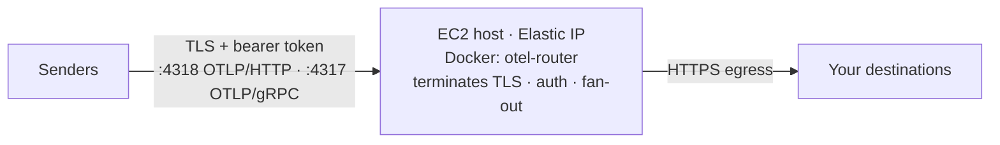

# ec2-docker

Runs otel-router on a **single EC2 instance** via Docker, directly
internet-facing on an **Elastic IP**. There is no load balancer: the
**container terminates the sender's TLS itself** — using a PEM cert/key you keep
in Secrets Manager — and enforces the inbound bearer token as always. This is
the module for teams that do **not** run ECS. If you are already on ECS, the
sibling [`ecs-fargate`](../ecs-fargate/) module runs the same container as a
managed, autoscaled service behind an ALB with an ACM certificate instead.

Transport and auth stay independent layers: TLS ends at the container, and every
request must still carry the inbound bearer token, which the router enforces. A
caller that reaches the instance without the token gets `Unauthenticated`.

## Architecture



The instance's Elastic IP is the front door. Point a DNS record whose name
matches the certificate's SAN at that IP; senders dial the hostname, not the raw
address. The security group admits the OTLP ports only from the CIDRs you name;
the health port (13133) is never exposed — it stays local to the box as the
container's own Docker healthcheck.

## How it works

Cloud-init (`templates/user-data.sh.tftpl`) runs once on first boot and:

1. installs Docker and the AWS CLI, plus the ECR credential helper so
   `docker pull` of an ECR image authenticates through the instance profile;
2. installs a **systemd unit** (`otel-router.service`) whose `ExecStart` script
   fetches `INBOUND_TOKEN`, the destination secrets, and the PEM cert/key from
   Secrets Manager into `/run` (tmpfs) on **every start**, chowns the cert and
   key to the container's UID (`10001`), then runs the container with
   `TLS_ENABLED=true` and the certs bind-mounted read-only at `/certs`.

Because the secrets are re-fetched on every (re)start and only ever live in
tmpfs, **nothing secret is written to the EBS volume**, and rotating a secret is
just `systemctl restart otel-router` (or a reboot). `Restart=always` keeps the
app up across crashes.

For a shell on the box, use **SSM Session Manager** (the instance profile grants
it) — there is no SSH port and no key pair by default. `key_name` and an SSH
ingress rule exist only if you deliberately opt in.

## Prerequisites

- **The image in ECR.** Build it from this repo's Dockerfile and push it to your
  registry; `destinations.yaml` is baked in at build time, so the image is
  necessarily yours. The instance authenticates ECR pulls through its instance
  profile.
- **Secrets in Secrets Manager:** the inbound token, the destination
  credentials your `destinations.yaml` references, and the **PEM certificate and
  private key** the container serves.
- **A certificate whose SAN matches the hostname senders will dial.** The
  container presents this cert directly, so a mismatched name fails
  verification. A self-signed pair for testing (from `.env.example`):

  ```sh
  openssl req -x509 -newkey rsa:2048 -nodes -days 365 \
    -keyout tls.key -out tls.crt \
    -subj "/CN=otel.example.com" -addext "subjectAltName=DNS:otel.example.com"

  aws secretsmanager create-secret --name otel-router/tls-cert --secret-string file://tls.crt
  aws secretsmanager create-secret --name otel-router/tls-key  --secret-string file://tls.key
  ```

## Usage

```hcl
module "otel_router" {
  # From a local checkout; when consuming from git, pin a tag:
  # source = "github.com/edmerrett/otel-router//terraform/modules/ec2-docker?ref=<tag>"
  source = "./modules/ec2-docker"

  vpc_id    = module.vpc.vpc_id
  subnet_id = module.vpc.public_subnets[0] # one public subnet — single instance

  image                    = "123456789012.dkr.ecr.eu-west-1.amazonaws.com/otel-router:v1.0.0"
  inbound_token_secret_arn = aws_secretsmanager_secret.inbound_token.arn
  tls_cert_secret_arn      = aws_secretsmanager_secret.tls_cert.arn
  tls_key_secret_arn       = aws_secretsmanager_secret.tls_key.arn

  # Fail-closed: the module refuses to plan until you name who may connect.
  # ["0.0.0.0/0"] accepts any source (the bearer token still gates content);
  # narrow to your senders' CIDRs when you can.
  allowed_cidrs = ["0.0.0.0/0"]

  router_config = {
    # Endpoints are plain config; credentials stay in Secrets Manager.
    # Cover EVERY variable your baked-in destinations.yaml references — the
    # collector refuses to start on unset ones.
    extra_environment_variables = {
      BACKEND_ENDPOINT = "https://your-backend.example.com:4318"
    }
    extra_secrets = {
      BACKEND_AUTH = aws_secretsmanager_secret.backend_auth.arn
    }
    # Same fail-closed discipline as .env: refuse to start without these.
    require_env = ["BACKEND_ENDPOINT", "BACKEND_AUTH"]
  }

  tags = {
    service = "otel-router"
  }
}
```

Then point senders at `module.otel_router.otlp_http_endpoint` (or the gRPC one)
with `Authorization: Bearer <INBOUND_TOKEN>` — via a DNS record for a hostname
the certificate actually covers, aimed at `module.otel_router.public_ip`.

## Inputs

| Name | Type | Default | Description |
|------|------|---------|-------------|
| `name` | `string` | `"otel-router"` | Prefix for everything the module names (instance, security group, IAM role/profile, EIP, alarm). 1–27 chars, lowercase alphanumeric and hyphens. |
| `vpc_id` | `string` | required | VPC for the security group. |
| `subnet_id` | `string` | required | One **public** subnet for the instance — it needs a route to an internet gateway so the EIP is reachable and the box can pull from ECR and reach your destinations. |
| `image` | `string` | required | Full URI of the otel-router image you built and pushed. ECR URIs are pulled via the instance profile; non-ECR registries need their own credentials on the host. |
| `inbound_token_secret_arn` | `string` | required | Secrets Manager ARN whose value is `INBOUND_TOKEN`. Fetched into tmpfs at start; never on EBS. Generate with `openssl rand -hex 32`. |
| `tls_cert_secret_arn` | `string` | required | Secrets Manager ARN holding the PEM certificate (full chain) the container serves. Must cover the hostname senders dial. |
| `tls_key_secret_arn` | `string` | required | Secrets Manager ARN holding the PEM private key matching the cert. |
| `tags` | `map(string)` | `{}` | Applied to every taggable resource. |
| `instance_type` | `string` | `"t3.small"` | EC2 instance type. The default AMI is x86_64; for an arm64 type also supply an arm64 `ami_id` and an arm64 image. |
| `ami_id` | `string` | `null` | AMI to launch. `null` resolves the latest Amazon Linux 2023 x86_64 AMI from SSM. The user-data assumes an AL2023 host. |
| `key_name` | `string` | `null` | EC2 key pair for SSH. `null` provisions no key and opens no SSH port — use SSM Session Manager instead. |
| `root_volume_size` | `number` | `20` | Root EBS volume size (GiB). Always gp3 and encrypted. |
| `enable_auto_recovery` | `bool` | `true` | Create a CloudWatch alarm that recovers the instance on a system-status-check failure (keeps the instance id and EIP). |
| `allowed_cidrs` | `list(string)` | `[]` | CIDR ranges allowed to reach the OTLP ports. **Required non-empty** — fails closed otherwise. `["0.0.0.0/0"]` accepts any source. |
| `enable_grpc` | `bool` | `true` | `false` drops the 4317 (OTLP/gRPC) ingress rule and does not publish 4317, leaving only 4318 (OTLP/HTTP). |
| `router_config` | `object` | `{}` | Container-level config; every attribute optional (table below). |

### `router_config` attributes

| Attribute | Type | Default | Description |
|-----------|------|---------|-------------|
| `extra_environment_variables` | `map(string)` | `{}` | Plain env your `destinations.yaml` references, e.g. `BACKEND_ENDPOINT`. Written to the container's env file at start. |
| `extra_secrets` | `map(string)` | `{}` | Env var name ⇒ Secrets Manager secret ARN, e.g. `BACKEND_AUTH`. Fetched into tmpfs at start; never on EBS or in Terraform state. |
| `require_env` | `list(string)` | `[]` | Vars the entrypoint must refuse to start without; rendered space-separated into `REQUIRE_ENV` (omitted when empty). |

`extra_environment_variables` / `extra_secrets` may not set `INBOUND_TOKEN`,
`REQUIRE_ENV`, `TLS_ENABLED`, `TLS_CERT_FILE` or `TLS_KEY_FILE` — the module owns
those and rejects the collision at plan time.

## Outputs

| Output | Description |
|--------|-------------|
| `public_ip` | The Elastic IP — the stable public address. Aim a DNS name matching the cert SAN here. |
| `otlp_http_endpoint` | `https://<eip>:4318` — the value for `OTEL_EXPORTER_OTLP_ENDPOINT` with `http/protobuf`. |
| `otlp_grpc_endpoint` | `https://<eip>:4317`; `null` when `enable_grpc` is false. |
| `instance_id` | EC2 instance id (SSM Session Manager, dashboards, alarms). |
| `security_group_id` | Instance security group — reference it to admit more senders. |
| `iam_role_arn` | Instance role (SSM, ECR pulls, GetSecretValue on the referenced secrets). |
| `eip_allocation_id` | Elastic IP allocation id, e.g. for a Route 53 record or a shared EIP inventory. |

## Operational notes

**Secret rotation is a restart.** The secrets and the PEM pair are fetched fresh
on every service start, so after rotating any of them in Secrets Manager, run
`systemctl restart otel-router` on the box (via SSM Session Manager) or reboot
the instance to pick them up. Nothing secret persists on the EBS volume — only
in `/run` tmpfs.

**Single instance, deliberately.** This is one box, so a hardware failure means
a brief outage. `enable_auto_recovery` (on by default) recovers the instance on
a failed EC2 system status check while keeping the **same instance id and the
same Elastic IP**, so the endpoint address survives. Application crashes are
handled in-place by `systemd Restart=always` and Docker's own restart, without
touching the instance. If you need continuous availability across an AZ outage,
use the `ecs-fargate` module instead — that is the honest tradeoff for the
simplicity of a single VM.

**The certificate must match the dialed hostname.** The container presents the
PEM cert directly (no ACM, no ALB), so senders verify it against the hostname
they connect to. Put that hostname in the certificate's SAN and aim a DNS record
for it at the Elastic IP. Dialing the raw IP works only if the cert carries an
IP SAN.

**Secrets encrypted with a customer-managed KMS key.** The instance role gets
`secretsmanager:GetSecretValue` on exactly the secrets it reads. That suffices
for secrets encrypted with the AWS-managed `aws/secretsmanager` key. If yours
use a customer-managed key, the role also needs `kms:Decrypt` on that key —
attach a policy granting it to the role (`iam_role_arn`) out of band.

**Non-ECR registries.** The user-data wires the ECR credential helper for the
image's registry host only. If you pull from a non-ECR registry, configure that
registry's credentials on the host yourself.

**Cost.** One EC2 instance plus one Elastic IP — materially cheaper than the
`ecs-fargate` path (Fargate tasks + ALB + NAT), in exchange for the
single-instance availability tradeoff above.
