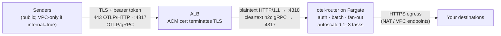

# private-alb

Runs otel-router on ECS Fargate behind an **Application Load Balancer** that
terminates TLS with an ACM certificate; the router speaks plaintext in a
private subnet behind it. The container is always private — only the ALB is
exposed. By default the ALB is **internet-facing** (put it in public subnets);
set `alb_config.internal = true` to restrict it to the VPC and anything routed
into it (peering, VPN, Direct Connect, Transit Gateway) instead. Either way the
load balancer decrypts and forwards plaintext to the container over a
security-group-scoped hop inside the VPC.

Reach for this module whenever you want AWS to manage the certificate. The
sibling [`public-nlb`](../public-nlb/) module is for the stricter case where
TLS must stay **end-to-end** — the load balancer never holding a key or seeing
plaintext — which it achieves by passing TCP straight through to a router that
terminates TLS itself.

Transport and auth stay independent layers: TLS ends at the ALB, but every
request must still carry the inbound bearer token, which the router itself
enforces. A caller that reaches the ALB without the token gets
`Unauthenticated`.

## Architecture



Two HTTPS listeners share the certificate: `:443` forwards to an HTTP1 target
group on container port 4318 (health-checked against the plain-HTTP `:13133`
endpoint), and `:4317` forwards to a gRPC target group on container port 4317
(health-checked on the traffic port — see the notes below for why). The task
security group admits traffic from the ALB security group only; the ECS
service runs with a deployment circuit breaker, container-level health checks
and CPU/memory target-tracking autoscaling.

## Usage

Prerequisites: the image built from this repo's Dockerfile and pushed to your
registry, a Secrets Manager secret holding the inbound token, and an ACM
certificate for the hostname senders will dial.

```hcl
module "otel_router" {
  # From a local checkout; when consuming from git, pin a tag:
  # source = "github.com/edmerrett/otel-router//terraform/modules/private-alb?ref=<tag>"
  source = "./modules/private-alb"

  vpc_id          = module.vpc.vpc_id
  task_subnet_ids = module.vpc.private_subnets
  lb_subnet_ids   = module.vpc.public_subnets # internet-facing ALB (default)

  image                    = "123456789012.dkr.ecr.eu-west-1.amazonaws.com/otel-router:v1.0.0"
  inbound_token_secret_arn = aws_secretsmanager_secret.inbound_token.arn
  certificate_arn          = var.certificate_arn

  alb_config = {
    # Fail-closed: the module refuses to plan until at least one source is
    # named here or in allowed_security_groups. Narrow to your senders' CIDRs;
    # ["0.0.0.0/0"] accepts any source (the bearer token still gates content).
    # For a VPC-only ALB set internal = true and use private lb_subnet_ids.
    allowed_cidrs = ["0.0.0.0/0"]
  }

  otel_router_config = {
    # Endpoints are plain config; credentials stay in Secrets Manager.
    # Cover EVERY variable your baked-in destinations.yaml references — the
    # collector refuses to start on unset ones. This shape assumes an image
    # built with only the backend destination; the shipped two-destination
    # config also needs WEBHOOK_ENDPOINT / WEBHOOK_API_KEY / WEBHOOK_SECRET.
    extra_environment_variables = {
      BACKEND_ENDPOINT = "https://your-backend.example.com:4318"
    }
    extra_secrets = {
      BACKEND_AUTH = aws_secretsmanager_secret.backend_auth.arn
    }
    # Same fail-closed discipline as .env: refuse to start without these.
    require_env = ["BACKEND_ENDPOINT", "BACKEND_AUTH"]
  }

  tags = {
    service = "otel-router"
  }
}
```

Then point senders at `module.otel_router.otlp_http_endpoint` (or the gRPC
one) with `Authorization: Bearer <INBOUND_TOKEN>` — ideally via a Route 53
record for a hostname the certificate actually covers.

## Inputs

| Name | Type | Default | Description |
|------|------|---------|-------------|
| `name` | `string` | `"otel-router"` | Prefix for everything the module names. 1–27 chars, lowercase alphanumeric and hyphens: the target groups append `-http`/`-grpc`, and the result must fit AWS's 32-char LB/target-group name cap. |
| `vpc_id` | `string` | required | VPC for the ALB, target groups and security groups. |
| `task_subnet_ids` | `list(string)` | required | Private subnets for the Fargate tasks. No public IPs are assigned, so they need NAT or VPC endpoints to reach ECR and your destinations. |
| `lb_subnet_ids` | `list(string)` | required | Subnets for the ALB, in at least two Availability Zones (an ALB requirement). Public subnets for the default internet-facing ALB; private subnets (typically the task subnets) if you set `alb_config.internal = true`. |
| `image` | `string` | required | Full URI of the otel-router image you built and pushed. There is no published image: `destinations.yaml` is baked in at build time, so the image is necessarily yours. |
| `inbound_token_secret_arn` | `string` | required | Secrets Manager secret ARN whose value is `INBOUND_TOKEN`. Injected at container start; never appears in the task definition. Generate with `openssl rand -hex 32`. |
| `certificate_arn` | `string` | required | ACM certificate for both HTTPS listeners. Senders must dial a hostname covered by its SANs. |
| `tags` | `map(string)` | `{}` | Applied to every taggable resource. |
| `otel_router_config` | `object` | `{}` | Service-level tuning; every attribute optional (table below). |
| `alb_config` | `object` | `{}` | ALB behaviour; every attribute optional, but at least one ingress source is required (table below). |

### `otel_router_config` attributes

| Attribute | Type | Default | Description |
|-----------|------|---------|-------------|
| `cpu` | `number` | `256` | Fargate task CPU units (256 = 0.25 vCPU). Must form a valid Fargate pairing with `mem`. |
| `mem` | `number` | `512` | Task memory in MiB. |
| `desired_count` | `number` | `1` | Initial task count; autoscaling owns it afterwards (the module ignores later drift). |
| `cpu_architecture` | `string` | `"X86_64"` | `"X86_64"` or `"ARM64"` — match the platform you built the image for. |
| `family` | `string` | `null` | Task definition family. `null` uses `name`. |
| `ecs_cluster_arn` | `string` | `null` | Existing cluster to run in. `null` creates one named `name` with Container Insights enabled. |
| `security_groups` | `list(string)` | `null` | Bring-your-own task security groups. `null` creates one that admits only the ALB. |
| `extra_environment_variables` | `map(string)` | `{}` | Plain env your `destinations.yaml` references, e.g. `BACKEND_ENDPOINT`. |
| `extra_secrets` | `map(string)` | `{}` | Env var name ⇒ Secrets Manager secret ARN, e.g. `BACKEND_AUTH`. Injected at container start. |
| `require_env` | `list(string)` | `[]` | Vars the entrypoint must refuse to start without; rendered space-separated into `REQUIRE_ENV` (omitted entirely when empty). |
| `extra_iam_policies` | `list(string)` | `[]` | Policy ARNs attached to the (otherwise empty) task role. |
| `extra_execution_iam_policies` | `list(string)` | `[]` | Policy ARNs attached to the execution role — see the KMS note below. |
| `logging.retention_in_days` | `number` | `30` | Retention for the module-created log group. |
| `logging.log_group_name` | `string` | `null` | Existing log group to write to instead. `null` creates `/ecs/<name>`. |
| `autoscaling.min_capacity` | `number` | `1` | Lower bound on task count. |
| `autoscaling.max_capacity` | `number` | `3` | Upper bound on task count. |
| `autoscaling.cpu_target_value` | `number` | `80` | Target average CPU utilisation (%) for target tracking. |
| `autoscaling.memory_target_value` | `number` | `80` | Target average memory utilisation (%) for target tracking. |

### `alb_config` attributes

| Attribute | Type | Default | Description |
|-----------|------|---------|-------------|
| `internal` | `bool` | `false` | `false` (default) is an internet-facing ALB (needs public `lb_subnet_ids`). Set `true` to restrict it to the VPC and anything routed into it (peering, VPN, Direct Connect); `lb_subnet_ids` may then be private. |
| `https_port` | `number` | `443` | OTLP/HTTP listener port (senders append `/v1/traces` etc.). |
| `grpc_port` | `number` | `4317` | OTLP/gRPC listener port. |
| `enable_grpc` | `bool` | `true` | `false` drops the gRPC listener, target group and security group openings. |
| `allowed_cidrs` | `list(string)` | `[]` | CIDR ranges allowed to reach the listeners. |
| `allowed_security_groups` | `list(string)` | `[]` | Security groups allowed to reach the listeners. |
| `ssl_policy` | `string` | `"ELBSecurityPolicy-TLS13-1-2-2021-06"` | TLS negotiation policy for both listeners. |
| `idle_timeout` | `number` | `300` | Seconds a connection may sit idle — see the keepalive note below. |

At least one of `allowed_cidrs` / `allowed_security_groups` must be non-empty;
both default to empty so the ALB fails closed, and the module rejects the
all-empty combination loudly at plan time rather than shipping an endpoint
nothing can reach.

## Outputs

| Output | Description |
|--------|-------------|
| `otlp_http_endpoint` | `https://<alb dns>:<https_port>` — the value for `OTEL_EXPORTER_OTLP_ENDPOINT` with `http/protobuf`. |
| `otlp_grpc_endpoint` | `https://<alb dns>:<grpc_port>`; `null` when gRPC is disabled. |
| `lb_dns_name` | ALB DNS name; point a Route 53 alias/CNAME matching the certificate SAN at it. |
| `lb_zone_id` | ALB hosted zone ID, for Route 53 alias records. |
| `lb_arn` | ARN of the ALB. |
| `lb_security_group_id` | ALB security group — reference it to admit more senders later. |
| `task_security_group_id` | Module-created task security group; `null` when you brought your own. |
| `ecs_cluster_arn` | Cluster running the service (created or passed in). |
| `ecs_service_name` | ECS service name (for `aws ecs update-service`, dashboards, alarms). |
| `task_definition_arn` | Active task definition ARN, with revision. |
| `task_role_arn` | The (intentionally empty) task role. |
| `execution_role_arn` | Execution role: image pulls, logs, secret injection. |
| `log_group_name` | CloudWatch log group receiving the router's stdout/stderr. |

## Operational notes

**The gRPC health check looks wrong — it isn't.** A target group with
`protocol_version = "GRPC"` frames its health check as a gRPC request, so it
*cannot* probe the plain-HTTP health endpoint on 13133 the way the HTTP1
target group does. The probe therefore stays on the traffic port (4317) with
the default `/AWS.ALB/healthcheck` path and `matcher = "0-99"`. Because the
probe carries no bearer token, the collector answers `UNAUTHENTICATED` (16) or
`UNIMPLEMENTED` (12) — and that is fine: any gRPC-framed answer proves the
server is up, which is all a health check needs. Real telemetry without the
token is still rejected.

**Idle timeout vs gRPC keepalives.** ALBs do not answer HTTP/2 PING frames,
so gRPC keepalives never reset the idle clock — only real data does. A sender
holding a connection open but exporting rarely will see it reset once
`idle_timeout` (default here: 300s, vs AWS's 60s) elapses with no data. Most
OTLP exporters reconnect transparently, but if yours flush less often than
every five minutes, raise `alb_config.idle_timeout` rather than fighting
resets.

**Secrets encrypted with a customer-managed KMS key.** The execution role gets
`secretsmanager:GetSecretValue` on exactly the secrets the task definition
references. That suffices for secrets encrypted with the AWS-managed
`aws/secretsmanager` key. If yours use a customer-managed key, the role also
needs `kms:Decrypt` on that key — pass a policy granting it via
`otel_router_config.extra_execution_iam_policies`.

**Token rotation is a restart.** The secret value is injected at container
start, so after rotating `INBOUND_TOKEN` in Secrets Manager, force a new
deployment (`aws ecs update-service --force-new-deployment`) to pick it up.
