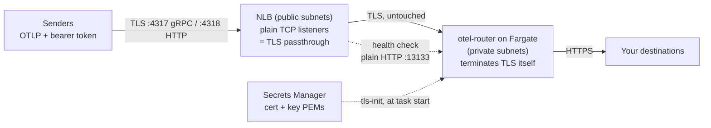

# public-nlb: internet-facing NLB with end-to-end TLS

Deploys otel-router on ECS Fargate behind an **internet-facing Network Load
Balancer**, for the case where senders reach you across the public internet
(a DMZ deployment). The NLB's listeners are **plain TCP**, which on an NLB
means TLS passthrough: the encrypted byte stream is forwarded untouched and
**otel-router terminates TLS itself**, with a certificate and key delivered
from Secrets Manager at task start. The load balancer never holds a key and
never sees plaintext telemetry.

If you do not need end-to-end encryption — you are content for the load
balancer to terminate TLS with an AWS-managed (ACM) certificate and forward
plaintext to the container over an in-VPC hop — the sibling
[`private-alb`](../private-alb) module is the simpler choice, and is
internet-facing by default (`alb_config.internal = true` to restrict it to the
VPC). Reach for this `public-nlb` module specifically when the load balancer
must never hold the key or see plaintext.

## Architecture



Traffic enters through the NLB in your public subnets and is passed through,
still encrypted, to Fargate tasks in your private subnets. The tasks have no
public IP; their security group admits traffic only *from the NLB's security
group, by reference*, so nothing else can reach them. Health checks bypass
TLS entirely: the collector's health endpoint (`:13133`) stays plain HTTP
even in TLS mode, by design, precisely so the NLB can probe it without
trusting the router's certificate.

## How the TLS cert and key reach the container

The router image is `FROM scratch`, runs as UID 10001, and has no writable
path anywhere - and Fargate task volumes come up root-owned. So the PEMs
cannot be baked in, and the router cannot write them itself. The module uses
a verified init-container pattern instead:

1. You store the certificate (full chain) and private key as two Secrets
   Manager secrets whose **values are the raw PEMs**.
2. At task start, ECS injects both PEMs as environment variables
   (`TLS_CERT_PEM` / `TLS_KEY_PEM`) into **`tls-init`**, a tiny busybox
   container that runs as root, writes them to a shared ephemeral task
   volume, `chown`s them to the router's UID and locks the key to
   owner-read (`0400`). It exits and is never restarted.
3. The router container mounts the same volume **read-only** at `/otel-tls`,
   starts only after tls-init succeeded (`dependsOn: SUCCESS`), and boots
   with `TLS_ENABLED=true`. Its entrypoint fails closed - refusing to start
   rather than silently serving plaintext - if the files are missing or
   unreadable.

The volume is Fargate-local scratch storage: it lives and dies with the task,
so the key never touches anything durable.

Creating the secrets, with a self-signed certificate for testing (the
one-liner from [`.env.example`](../../../.env.example)):

```bash
# Set the SAN to the hostname clients dial - TLS verification is against the
# name in the URL, so a mismatched SAN fails every sender.
openssl req -x509 -newkey rsa:2048 -nodes -days 365 \
  -keyout tls.key -out tls.crt \
  -subj "/CN=otel.example.com" -addext "subjectAltName=DNS:otel.example.com"

aws secretsmanager create-secret --name otel-router/tls-cert --secret-string file://tls.crt
aws secretsmanager create-secret --name otel-router/tls-key  --secret-string file://tls.key
```

In production, use a CA-issued certificate for a real hostname (e.g.
`otel.example.com`), CNAME that hostname to the NLB DNS name (`lb_dns_name`
output), and point senders at the hostname - never at the raw
`*.elb.amazonaws.com` name, which will not match your certificate's SAN.

## Usage

```hcl
module "otel_router" {
  source = "github.com/edmerrett/otel-router//terraform/modules/public-nlb?ref=<tag>"

  vpc_id          = module.vpc.vpc_id
  task_subnet_ids = module.vpc.private_subnets # tasks: no public IP, egress via NAT/endpoints
  lb_subnet_ids   = module.vpc.public_subnets  # the internet-facing NLB lives here

  # The image you built from this repo's Dockerfile and pushed to ECR.
  image = "123456789012.dkr.ecr.eu-west-1.amazonaws.com/otel-router:v1"

  # Secrets Manager ARNs: the inbound bearer token and the PEM pair.
  inbound_token_secret_arn = aws_secretsmanager_secret.inbound_token.arn
  tls_cert_secret_arn      = aws_secretsmanager_secret.tls_cert.arn
  tls_key_secret_arn       = aws_secretsmanager_secret.tls_key.arn

  nlb_config = {
    # Required, no default: opening a public OTLP endpoint to the world must
    # be an explicit choice. Narrow this to your senders' egress CIDRs.
    allowed_cidrs = ["0.0.0.0/0"]
  }

  otel_router_config = {
    # Endpoints/credentials your destinations.yaml references. Cover EVERY
    # variable the file baked into your image uses — the collector refuses
    # to start on unset ones. This shape assumes an image built with only
    # the backend destination; the shipped two-destination config also
    # needs WEBHOOK_ENDPOINT / WEBHOOK_API_KEY / WEBHOOK_SECRET.
    extra_environment_variables = {
      BACKEND_ENDPOINT = "https://your-backend.example.com:4318"
    }
    extra_secrets = {
      BACKEND_AUTH = aws_secretsmanager_secret.backend_auth.arn
    }
    # Extend the entrypoint's fail-closed startup check to these.
    require_env = ["BACKEND_ENDPOINT", "BACKEND_AUTH"]
  }

  tags = { app = "otel-router" }
}
```

Senders then export to `https://otel.example.com:4318` (or `:4317` for gRPC)
with `Authorization: Bearer <INBOUND_TOKEN>` - see the
[root README](../../../README.md) for the Claude Code wiring.

## Inputs

| Name | Type | Default | Description |
|------|------|---------|-------------|
| `name` | `string` | `"otel-router"` | Prefix for every named resource. 1-27 chars, lowercase alphanumerics and hyphens: the target groups append `-http`/`-grpc`, and the result must fit AWS's 32-char LB/TG name cap. |
| `vpc_id` | `string` | required | VPC for the NLB, target groups and security groups. |
| `task_subnet_ids` | `list(string)` | required | Private subnets for the Fargate tasks; need egress to destinations and ECR/Secrets Manager/CloudWatch Logs (NAT or VPC endpoints). |
| `lb_subnet_ids` | `list(string)` | required | Public subnets for the internet-facing NLB (private subnets if `nlb_config.internal = true`). |
| `image` | `string` | required | URI of the otel-router image you built and pushed; there is no published image. |
| `inbound_token_secret_arn` | `string` | required | Secrets Manager secret whose value is the `INBOUND_TOKEN` senders must present. |
| `tls_cert_secret_arn` | `string` | required | Secrets Manager secret whose VALUE is the PEM certificate (full chain). SAN must match the hostname senders dial. |
| `tls_key_secret_arn` | `string` | required | Secrets Manager secret whose VALUE is the matching PEM private key. |
| `tls_init_image` | `string` | `"public.ecr.aws/docker/library/busybox:1.37"` | Init-container image; public ECR by default so Fargate needs no Docker Hub auth. |
| `tags` | `map(string)` | `{}` | Applied to every taggable resource. |

`nlb_config` (object, all attributes optional):

| Attribute | Type | Default | Description |
|-----------|------|---------|-------------|
| `internal` | `bool` | `false` | `true` places a private NLB in (private) `lb_subnet_ids` instead of an internet-facing one. |
| `enable_grpc` | `bool` | `true` | Create the 4317 listener/target group for OTLP/gRPC. |
| `allowed_cidrs` | `list(string)` | `[]` | **Must be non-empty** (validated at plan time). Source CIDRs admitted to the NLB; `["0.0.0.0/0"]` is a deliberate opt-in. |
| `cross_zone` | `bool` | `true` | Cross-zone load balancing (see operational notes). |

`otel_router_config` (object, all attributes optional):

| Attribute | Type | Default | Description |
|-----------|------|---------|-------------|
| `cpu` | `number` | `256` | Fargate CPU units for the task. |
| `mem` | `number` | `512` | Task memory in MiB. |
| `desired_count` | `number` | `1` | Initial task count; autoscaling owns it afterwards. |
| `cpu_architecture` | `string` | `"X86_64"` | Or `"ARM64"`; must match how the image was built. |
| `family` | `string` | `null` | Task definition family; `null` uses `name`. |
| `ecs_cluster_arn` | `string` | `null` | Existing cluster to deploy into; `null` creates one (container insights enabled). |
| `security_groups` | `list(string)` | `null` | Task security groups; `null` creates one admitting only the NLB SG. If you bring your own, admit `lb_security_group_id` on 4317/4318/13133. |
| `extra_environment_variables` | `map(string)` | `{}` | Plain env your `destinations.yaml` references, e.g. `BACKEND_ENDPOINT`. |
| `extra_secrets` | `map(string)` | `{}` | Env var name => Secrets Manager ARN, e.g. `BACKEND_AUTH`. |
| `require_env` | `list(string)` | `[]` | Rendered space-separated into `REQUIRE_ENV` (fail-closed startup check); the env var is omitted when empty. |
| `extra_iam_policies` | `list(string)` | `[]` | Policy ARNs attached to the (otherwise empty) task role. |
| `extra_execution_iam_policies` | `list(string)` | `[]` | Policy ARNs attached to the execution role, e.g. `kms:Decrypt` for CMK-encrypted secrets. |
| `logging.retention_in_days` | `number` | `30` | Retention for the module-created log group. |
| `logging.log_group_name` | `string` | `null` | Existing log group to use; `null` creates `/ecs/<name>`. |
| `autoscaling.min_capacity` | `number` | `1` | Scaling floor. |
| `autoscaling.max_capacity` | `number` | `3` | Scaling ceiling. |
| `autoscaling.cpu_target_value` | `number` | `80` | Target-tracking CPU utilisation (%). |
| `autoscaling.memory_target_value` | `number` | `80` | Target-tracking memory utilisation (%). |

## Outputs

| Name | Description |
|------|-------------|
| `ecs_cluster_arn` | Cluster running the service (created or passed in). |
| `ecs_service_name` | ECS service name. |
| `task_definition_arn` | Registered task definition ARN (with revision). |
| `task_security_group_id` | Module-created task SG, or `null` if you supplied your own. |
| `lb_security_group_id` | The NLB security group - the only source your own task SG needs to admit. |
| `task_role_arn` | The (deliberately empty) task role. |
| `execution_role_arn` | Execution role (image pull, logs, secrets). |
| `log_group_name` | Log group receiving the `otel-router` and `tls-init` streams. |
| `lb_arn` | NLB ARN. |
| `lb_dns_name` | NLB DNS name - CNAME your real hostname to this. |
| `lb_zone_id` | NLB hosted zone ID, for Route 53 alias records. |
| `otlp_grpc_endpoint` | `https://<nlb dns>:4317`, or `null` when gRPC is disabled. |
| `otlp_http_endpoint` | `https://<nlb dns>:4318`. |

Both endpoint outputs point at the raw NLB name, which is fine for smoke
tests with certificate verification disabled - production senders should use
your CNAMEd hostname so TLS verification passes.

## Operational notes

- **The NLB is created with its security group, always.** AWS only allows
  security groups on an NLB when attached at creation; an NLB created
  without one can never gain one. That SG is what lets the task SG admit
  traffic *by reference* (robust even with client IP preservation) instead
  of opening task ports to client CIDRs.
- **Cross-zone load balancing is on by default** so one AZ's unhealthy tasks
  never blackhole that AZ's share of traffic. It incurs a small inter-AZ
  data transfer cost; set `nlb_config.cross_zone = false` if that matters
  more to you than even spreading.
- **Rotating the certificate (or the inbound token) requires a new
  deployment.** ECS resolves container secrets once, at task start. After
  updating the secret *values* (the ARNs do not change), run
  `aws ecs update-service --cluster <cluster> --service <service>
  --force-new-deployment` and fresh tasks pick up the new material; the
  rolling deployment keeps the endpoint up throughout.
- **Customer-managed KMS keys.** If any referenced secret is encrypted with
  a CMK rather than the default `aws/secretsmanager` key, the execution role
  also needs `kms:Decrypt` on that key: pass a policy ARN granting it via
  `otel_router_config.extra_execution_iam_policies`.
- **Health checks are HTTP on 13133** even though the traffic ports are
  TLS - the collector's health endpoint stays plain HTTP in TLS mode by
  design, so the NLB can probe it without trusting your certificate.
